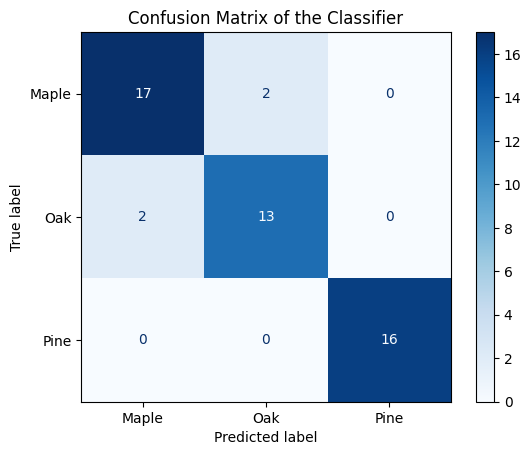

# Evaluation Results - TreeType Classifier

This document summarizes the performance of the **TreeType Classifier** trained on a tree dataset

---
## Classification Report 
the model was evaluated using cross-validation. The detailed classification report:

CLASSIFICATION REPORT:

               precision    recall  f1-score   support

       Maple       0.89      0.89      0.89        19
         Oak       0.87      0.87      0.87        15
        Pine       1.00      1.00      1.00        16

      accuracy                           0.92        50
      macro avg       0.92      0.92      0.92        50
    weighted avg       0.92      0.92      0.92        50

## CONFUSION MATRIX 
the confusion matrix provides a visual summary of how well the classifier predicts each tree type 

## SUMMARY 
- The classifier used a random forest model with hyperparameter tuning via `RandomizedSearchCV`
- Cross-Validation ensures that evaluation metrics are reliable and generalizable
- Overall Accuracy and per-class metrics are reported above
- The Confusion Matrix highlights areas where the model performs strongly and  where it may need improvement

